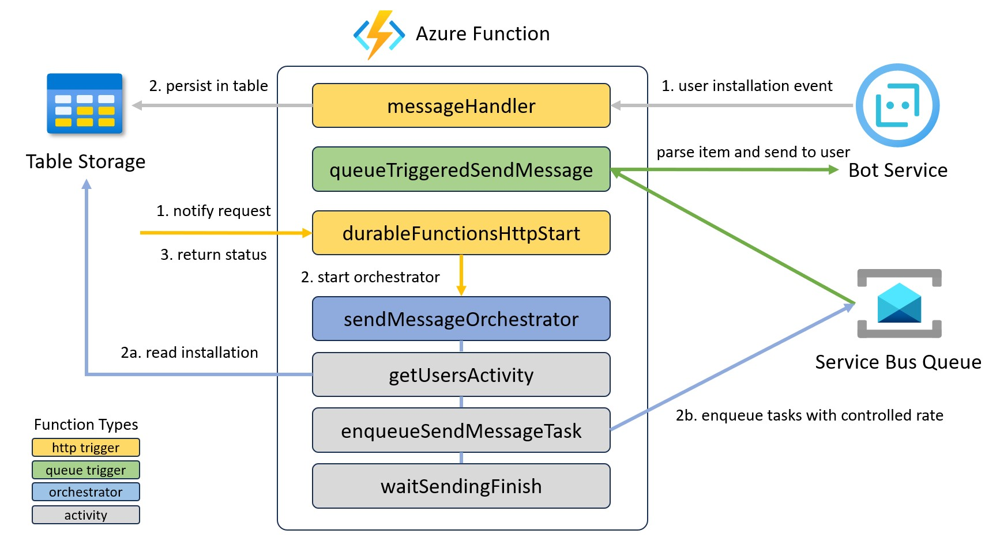

# Overview of the Notification Scale Demo

This sample demonstrates the architecture of a Teams notfication bot app created by Teams Toolkit to send individual chat messages to a large number of users in a tenant. This app relies on Azure services such as [Durable Function](https://learn.microsoft.com/en-us/azure/azure-functions/durable/durable-functions-overview?tabs=csharp-inproc) and [Service Bus Queue](https://learn.microsoft.com/en-us/azure/service-bus-messaging/service-bus-queues-topics-subscriptions#queues) to handle high volume and speed of notification messaging.

# How to run this project

## Execute lifecycle commands

1. To create the Azure resources and deploy the code to Azure Function, select `Provision` and `Deploy` from the Teams Toolkit sidebar.
2. To publish your app to Teams, select `Publish` from the Teams Toolkit sidebar.

## Install Teams App for all users

1. Visit https://admin.teams.microsoft.com/. Click "Manage apps" under "Teams apps" and find the app with name "notification-scale-demo-dev".
2. Click the app and click "Publish" to approve the request.
3. Copy "App Id" in app details page and paste it to variable `TEAMS_APP_ID` in `script/installAppForUsers.js`.
4. Visit https://developer.microsoft.com/en-us/graph/graph-explorer. Click "Modify permissions" and consent "TeamsAppInstallation.ReadWriteForUser".
5. Copy the "Access token" and paste it to variable `AUTH_TOKEN` in `script/installAppForUsers.js`.
6. Run command in project folder: `node script/installAppForUsers.js`.
7. Check the provisioned Azure Storage Account Table `installation` for installation records.

## Mock the installation of a large amount of users

Since there are usually at most 25 users in Microsoft 365 E3/E5 subscription in a tenant, duplicate the installation data can be used to mock a large amount of users.

1. Copy the value of `STORAGE_ACCOUNT_NAME` in `env/.env.dev` and paste it to variable `storageAccount` in `script/mockInstallationData.ts`.
2. Copy the value of `SECRET_STORAGE_ACCOUNT_KEY` in `env/.env.dev.user` by clicking "Decrypt secret" and paste it to variable `storageAccountKey` in `script/mockInstallationData.ts`.
3. Run command in project root folder: `npx ts-node script/mockInstallationData.ts`.

## Trigger send notification function

1. Visit `https://{BOT_FUNCTION_ENDPOINT}/api/notification` in browser. This will trigger the function to send notifications.
2. Check the link of `statusQueryGetUri` in returned json object, it reflects the sending status of this invocation.

## Extra: tradeoff between readability and speed

The activity function `getUserAndEnqueueSendMessageTask.ts` combines the functions of `getUsersActivity.ts` and `enqueueSendMessageTask.ts`. This way, it can perform more tasks in one function and avoid switching contexts. This improves the speed of sending messages to a large number of users (more than 100K) by reducing the overhead of context switching. However, this approach trades off code readability for performance. It also increases the chance of sending duplicate messages to users if the activity function fails.

1. Replace the content of `sendMessageOrchestrator.ts` with `sendMessageOrchestrator2.ts`.
2. Trigger send notification function as previous steps.

## Architecture

### Azure Function

This sample extends from the "Chat Notification Message" template created by Teams Toolkit. It makes Azure Function durable to send notifications in a long-running job.
Here's the functions used in this sample:

| Function                    | Type          | Description                                                                                                                                         |
| --------------------------- | ------------- | --------------------------------------------------------------------------------------------------------------------------------------------------- |
| `durableFunctionsHttpStart` | HTTP Trigger  | It starts orchestrator and returns sending status                                                                                                   |
| `messageHandler`            | HTTP Trigger  | It handles message from Bot service like new installation                                                                                           |
| `queueTriggeredSendMessage` | Queue Trigger | Service Bus Queue triggers this function to send 1:1 message to each user stored in queue item                                                      |
| `sendMessageOrchestrator`   | Orchestrator  | It fetches installation data and sends notifications to users continuously. It also updates the success/failure count in custom orchestrator status |
| `getUsersActivity`          | Activity      | It fetches installation data in Table storage with continuation token                                                                               |
| `enqueueSendMessageTask`    | Activity      | It sends tasks for each user in a batch to Service Bus Queue                                                                                        |
| `waitSendingFinishActivity` | Activity      | It will check the active message count in Service Bus Queue and wait until all items are processed                                                  |

The following image illustrates the architecture of functions interecting with Azure services.

### Performance Tuning

Here's the variables in `src/consts.ts` that users can change to tune the performance:

| Variable             | Usage                                                                   |
| -------------------- | ----------------------------------------------------------------------- |
| RPS                  | The sending speed of notification message                               |
| batchSendingInterval | Time(second) to wait before sending the next batch of messages to queue |
| maxPageSize          | Paginated result size when querying from table storage                  |

## Limitation

### Bot Framework Rate Limit

As stated in this [document](https://learn.microsoft.com/en-us/microsoftteams/platform/bots/how-to/rate-limit#per-bot-per-thread-limit), the throughput of a single bot app in theory is 180k/hour.

> The global limit per app per tenant is 50 Requests Per Second (RPS). Hence, the total number of bot messages per second must not cross the thread limit.

### Azure Storage Table

This sample uses continuation token to retrieve paged results. The maxium page size is 1000([doc](https://learn.microsoft.com/en-us/rest/api/storageservices/Query-Entities?redirectedfrom=MSDN#remarks)).

### Azure Durable Function

Orchestrator is a pure function that has no side effect, so it will be replayed and scheduled by Durable Task framework. The context switch time cost also affects the throughput of message sending. Having a big loop in orchestrator function may slows down the execution time.

### Dynamic Concurrency

This sample uses "Consumption" plan of Azure Function. The queue triggered function will be automatically scaled out to many instances. However this is a black box and spikes may happen during the sending process if there are not enough instances.
